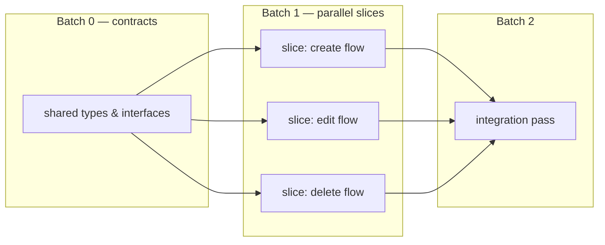

# orchestrator

A [Claude Code](https://claude.com/claude-code) skill that changes the main session's job description: **it never implements — it delegates.** The session you talk to is a foreman. It scopes work, decomposes it into batches of independent vertical slices, dispatches each slice to a right-sized subagent working in an isolated git worktree, verifies what comes back, and merges.

This README is the precise version of the logic. The skill itself ([orchestrator/SKILL.md](orchestrator/SKILL.md)) is the compressed, agent-facing version of the same rules.

## Why

Three constraints drive the whole design:

1. **Context is the scarce resource.** An agent reasons best inside a bounded "smart zone" — roughly the first **100k tokens** of context. A main thread that reads every file and holds every diff burns its smart zone on raw material. The orchestrator keeps the main thread as a thread of *decisions*; the raw material lives and dies inside subagents.
2. **Merges are where parallelism goes to die.** Two agents editing the same file produce conflicts that cost more to resolve than the parallelism saved. So parallel work must be *provably* collision-free — by construction, not by hope.
3. **The main checkout is sacred.** All implementation happens in git worktrees. The user's working tree never gets dirty; work merges only after review.

## The decomposition model: batches as a basis

Think of a feature the way linear algebra thinks of a vector space, and the set of subagents you dispatch the way it thinks of a **basis**: a set of vectors that is *spanning* (it reaches everything) and *linearly independent* (no vector is redundant). Both properties are load-bearing, and both are checkable before you dispatch.

### Definitions

For a feature **F**, a decomposition into slices s₁ … sₙ, where each slice has a deliverable **D(sᵢ)** (what it produces) and a write-set **W(sᵢ)** (the files it modifies):

- **Spanning** — `D(s₁) ∪ … ∪ D(sₙ) = F`. The union of the slices' deliverables is the entire feature. Nothing falls between agents; if every slice completes, the feature is done, with no "and then someone glues it together" remainder.
- **Independent** — `W(sᵢ) ∩ W(sⱼ) = ∅` for all `i ≠ j`. No two slices in a batch write the same file. Independence is about **write-sets only**: every slice may freely *read* the whole repo. Collisions come from writes, so disjoint writes make merges conflict-free by construction. Write-sets are declared when the batch is planned; a slice that writes outside its declaration is a planning bug, caught at the boundary merge.
- **Vertical** — each slice is an end-to-end unit of the feature (schema + logic + UI + test for one behavior), not a horizontal layer ("all the backend", "all the CSS"). Horizontal layers are almost never independent — every layer touches the shared seams — and no single layer is a verifiable piece of the feature on its own. Vertical slices are both.

**Slicing is recursive.** Vertical is measured relative to the thing being sliced. Relative to the whole product, a feature is itself a vertical slice — it cuts through every layer while covering a sliver of the product's breadth. Zoom into the feature and it has internal layers of its own, so an oversized slice re-splits vertically *with respect to its own deliverable*. At no scale does splitting by layer become correct; the recursion bottoms out when a slice fits one agent's smart zone.

A **batch** is a set of vertical slices that is spanning and independent. Complete a batch and it covers its target and merges without conflicts — that's the definition doing the work. Whether the merged result *behaves* is a separate question, settled at the batch boundary (below). (Strictly, these definitions make a batch a *partition* of the feature — disjoint pieces that cover the whole — which is exactly the property the basis analogy is borrowed for: spanning without redundancy.)

### Scheduling: the dependency DAG

Work items form a directed acyclic graph: an edge `a → b` means *b needs a's output to start*. Batches are the topological levels of that DAG:

- **No edges** (nothing depends on anything else) → the whole feature is **one batch**. Dispatch every slice in parallel and go.
- **Edges exist** → sort into sequential batches. Each batch is internally parallel; batch *k+1* dispatches only after batch *k* has **merged and verified**.



### Orthogonalize before you parallelize

The common failure mode: every slice of a feature *would* collide on one shared seam — the types file, the schema, the route registry, the barrel export. Naively parallelized, that's n agents all editing `types.ts`.

The fix is a **contract batch**: a small, fast batch dispatched first that defines and freezes the shared interfaces. Once the contract is frozen, the remaining slices build against it and become genuinely disjoint. This is the Gram–Schmidt move in spirit — subtract the shared component from every slice, and what remains is disjoint.

### The context budget

Every slice must fit its agent inside the ~**100k-token smart zone**: repo reading + instructions + its own work. Sizing rules:

- A slice too big to fit **splits along another vertical seam** — never into horizontal layers.
- A slice that cannot split without breaking independence becomes **its own sequential batch**.

This is why the batch model and the context budget are one system, not two rules: batch boundaries are exactly where you re-plan scope so that no agent ever works past the edge of its smart zone.

### The batch boundary ritual

Spanning of *tasks* does not guarantee the *composition* works — n green slices can still compose into a broken feature. So every batch boundary runs the same sequence:

1. Merge all worktrees from the batch.
2. Verify the **composed** result (build, tests, a review pass on the integrated whole).
3. Plan the next batch against the new base.

### The redundancy exemption

"No redundancy" binds **construction** only. Verification is deliberately redundant — multiple independent reviewers, adversarial verifiers trying to refute a finding — because redundancy is exactly what makes verification trustworthy. Never let the independence rule thin out the verify stage.

## Hard rules (the agent-facing core)

1. The main thread never implements. Anything beyond a trivial edit is delegated.
2. All implementation happens in git worktrees; the main checkout stays clean.
3. Every subagent gets a deliberately chosen model tier and reasoning effort — matched to the slice's difficulty, never mismatched in either direction.
4. Subagent reports return **conclusions and rejected alternatives**, not file dumps.
5. **Delegation is one level deep — subagents never delegate.** Every dispatch brief states it verbatim. A subagent that needs to delegate is proof the slice was too big; the fix is re-slicing by the orchestrator, never a second layer of orchestration — nested delegation loses the brief's context at every hop, hides work from review, and breaks the fleet plan's tier assignments.
6. **Completion is a clean commit, not a report file.** Agents scaffold reports early, so a report's existence proves nothing; anything watching for completion keys on committed-and-clean state.
7. **Terminal hygiene.** Once a delegate's work is reviewed and merged (or discarded), its terminal closes — stale idle sessions are where rogue agents hide. At every batch boundary, audit the live agents: each one must map to a task the orchestrator currently owns.

These rules guard *implementation*, not conversation: answering questions, reading and explaining code, git operations, and read-only commands stay in the main thread — no delegation theater for a one-line answer.

Rule 3 pairs this skill with a model-selection strategy; mine lives in [andres-skills](https://github.com/seeko-codes/andres-skills) as `model-strategy`, alongside the rest of my daily set.

## Install

```bash
git clone https://github.com/seeko-codes/orchestrator-skill.git
mkdir -p ~/.claude/skills
cp -R orchestrator-skill/orchestrator ~/.claude/skills/
```

Restart your Claude Code session; the skill registers automatically. Optional companion: the `model-strategy` skill from [andres-skills](https://github.com/seeko-codes/andres-skills), which hard rule 3 leans on for tier and effort assignment. To make it truly always-on (loaded every session rather than on trigger), register a small script under `hooks.SessionStart` in `~/.claude/settings.json` that prints the SKILL.md body as `additionalContext`.

## License

MIT — see [LICENSE](LICENSE).
